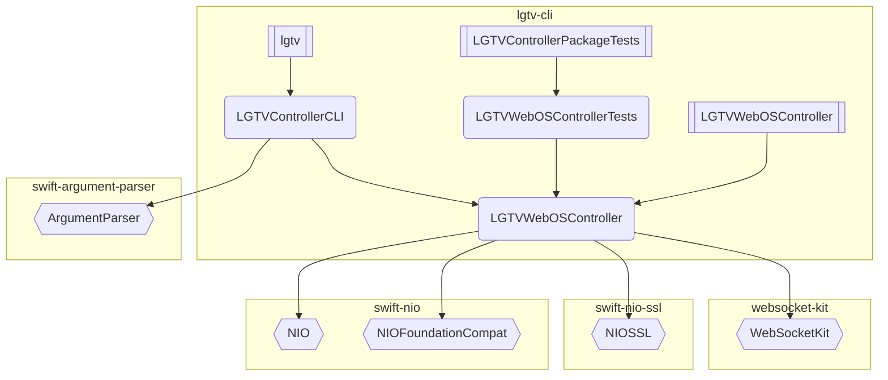

# package 
## package dependencies
## products
### target
## product dependencies


* package
  * name
  * version
  * remote URL or local path
  * owner / 1st or 3rd party

* product - public facing interface
  * name
  * type: lib, exe, etc..
  * Rel: targets

* target - individual modules of code - internal to the package (not publicly visible)


```zsh
Package.swift
Package.resolved
```

# swift package describe

```zsh
swift package describe --type text > lgtv-cli.txt
swift package describe --type json > lgtv-cli.json
swift package describe --type mermaid > lgtv-cli.mermaid
```



````markdown


```json
{
  "dependencies" : [
    {
      "identity" : "swift-argument-parser",
      "requirement" : {
        "range" : [
          {
            "lower_bound" : "1.2.0",
            "upper_bound" : "2.0.0"
          }
        ]
      },
      "type" : "sourceControl",
      "url" : "https://github.com/apple/swift-argument-parser.git"
    },
    {
      "identity" : "swift-nio",
      "requirement" : {
        "range" : [
          {
            "lower_bound" : "2.32.0",
            "upper_bound" : "3.0.0"
          }
        ]
      },
      "type" : "sourceControl",
      "url" : "https://github.com/apple/swift-nio.git"
    },
    {
      "identity" : "swift-nio-ssl",
      "requirement" : {
        "range" : [
          {
            "lower_bound" : "2.17.0",
            "upper_bound" : "3.0.0"
          }
        ]
      },
      "type" : "sourceControl",
      "url" : "https://github.com/apple/swift-nio-ssl.git"
    },
    {
      "identity" : "websocket-kit",
      "requirement" : {
        "range" : [
          {
            "lower_bound" : "2.6.0",
            "upper_bound" : "3.0.0"
          }
        ]
      },
      "type" : "sourceControl",
      "url" : "https://github.com/vapor/websocket-kit.git"
    }
  ],
  "manifest_display_name" : "LGTVController",
  "name" : "LGTVController",
  "path" : "/Users/zakkhoyt/code/repositories/z2k/github/lgtv-cli",
  "platforms" : [
    {
      "name" : "macos",
      "version" : "14.0"
    }
  ],
  "products" : [
    {
      "name" : "LGTVWebOSController",
      "targets" : [
        "LGTVWebOSController"
      ],
      "type" : {
        "library" : [
          "automatic"
        ]
      }
    },
    {
      "name" : "lgtv",
      "targets" : [
        "LGTVControllerCLI"
      ],
      "type" : {
        "executable" : null
      }
    }
  ],
  "targets" : [
    {
      "c99name" : "LGTVWebOSControllerTests",
      "module_type" : "SwiftTarget",
      "name" : "LGTVWebOSControllerTests",
      "path" : "Tests/LGTVWebOSControllerTests",
      "sources" : [
        "LGTVWebOSControllerTests.swift"
      ],
      "target_dependencies" : [
        "LGTVWebOSController"
      ],
      "type" : "test"
    },
    {
      "c99name" : "LGTVWebOSController",
      "module_type" : "SwiftTarget",
      "name" : "LGTVWebOSController",
      "path" : "Sources/LGTVWebOSController",
      "product_dependencies" : [
        "NIO",
        "NIOFoundationCompat",
        "NIOSSL",
        "WebSocketKit"
      ],
      "product_memberships" : [
        "LGTVWebOSController",
        "lgtv"
      ],
      "sources" : [
        "ConfigStore.swift",
        "LGTVConfig.swift",
        "LGTVWebOSClient.swift"
      ],
      "type" : "library"
    },
    {
      "c99name" : "LGTVControllerCLI",
      "module_type" : "SwiftTarget",
      "name" : "LGTVControllerCLI",
      "path" : "Sources/LGTVControllerCLI",
      "product_dependencies" : [
        "ArgumentParser"
      ],
      "product_memberships" : [
        "lgtv"
      ],
      "sources" : [
        "AllCommands.swift",
        "AuthCommands.swift",
        "CLI.swift",
        "Commands.swift",
        "EntryPoint.swift",
        "LGTVControllerCommand.swift"
      ],
      "target_dependencies" : [
        "LGTVWebOSController"
      ],
      "type" : "executable"
    }
  ],
  "tools_version" : "5.9"
}
```


```text
Name: LGTVController
Manifest display name: LGTVController
Path: /Users/zakkhoyt/code/repositories/z2k/github/lgtv-cli
Tools version: 5.9
Dependencies:
    Type:
        sourceControl
    Identity:
        swift-argument-parser
    Url: https://github.com/apple/swift-argument-parser.git
    Requirement:
        Range:
            Lower bound:
                1.2.0
            Upper bound:
                2.0.0

    Type:
        sourceControl
    Identity:
        swift-nio
    Url: https://github.com/apple/swift-nio.git
    Requirement:
        Range:
            Lower bound:
                2.32.0
            Upper bound:
                3.0.0

    Type:
        sourceControl
    Identity:
        swift-nio-ssl
    Url: https://github.com/apple/swift-nio-ssl.git
    Requirement:
        Range:
            Lower bound:
                2.17.0
            Upper bound:
                3.0.0

    Type:
        sourceControl
    Identity:
        websocket-kit
    Url: https://github.com/vapor/websocket-kit.git
    Requirement:
        Range:
            Lower bound:
                2.6.0
            Upper bound:
                3.0.0

Platforms:
    Name: macos
    Version: 14.0

Products:
    Name: LGTVWebOSController
    Type:
        Library:
            automatic
    Targets:
        LGTVWebOSController

    Name: lgtv
    Type:
        Executable: nil
    Targets:
        LGTVControllerCLI

Targets:
    Name: LGTVWebOSControllerTests
    Type: test
    C99name: LGTVWebOSControllerTests
    Module type: SwiftTarget
    Path: Tests/LGTVWebOSControllerTests
    Sources:
        LGTVWebOSControllerTests.swift
    Target dependencies:
        LGTVWebOSController

    Name: LGTVWebOSController
    Type: library
    C99name: LGTVWebOSController
    Module type: SwiftTarget
    Path: Sources/LGTVWebOSController
    Sources:
        ConfigStore.swift
        LGTVConfig.swift
        LGTVWebOSClient.swift
    Product dependencies:
        NIO
        NIOFoundationCompat
        NIOSSL
        WebSocketKit
    Product memberships:
        LGTVWebOSController
        lgtv

    Name: LGTVControllerCLI
    Type: executable
    C99name: LGTVControllerCLI
    Module type: SwiftTarget
    Path: Sources/LGTVControllerCLI
    Sources:
        AllCommands.swift
        AuthCommands.swift
        CLI.swift
        Commands.swift
        EntryPoint.swift
        LGTVControllerCommand.swift
    Target dependencies:
        LGTVWebOSController
    Product dependencies:
        ArgumentParser
    Product memberships:
        lgtv
```


# Open Source

The Swift Package Manager is fully open source. 
The code that generates the `text`, `json`, and `mermaid` diagrams is in the SwiftPM repository.


**Repository:** 
* [apple/swift-package-manager](https://github.com/apple/swift-package-manager)

**Relevant Files:**
- Main command implementation:[Sources/Commands/PackageCommands/Describe.swift](https://github.com/apple/swift-package-manager/blob/main/Sources/Commands/PackageCommands/Describe.swift) - 
- Package model: [Sources/PackageDescription/PackageDescription.swift](https://github.com/apple/swift-package-manager/blob/main/Sources/PackageDescription/PackageDescription.swift)