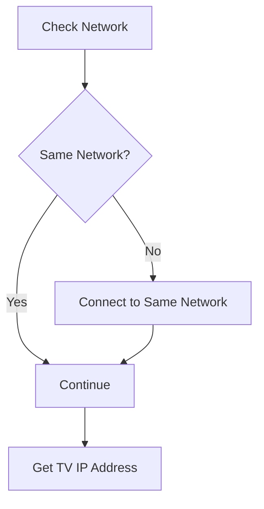
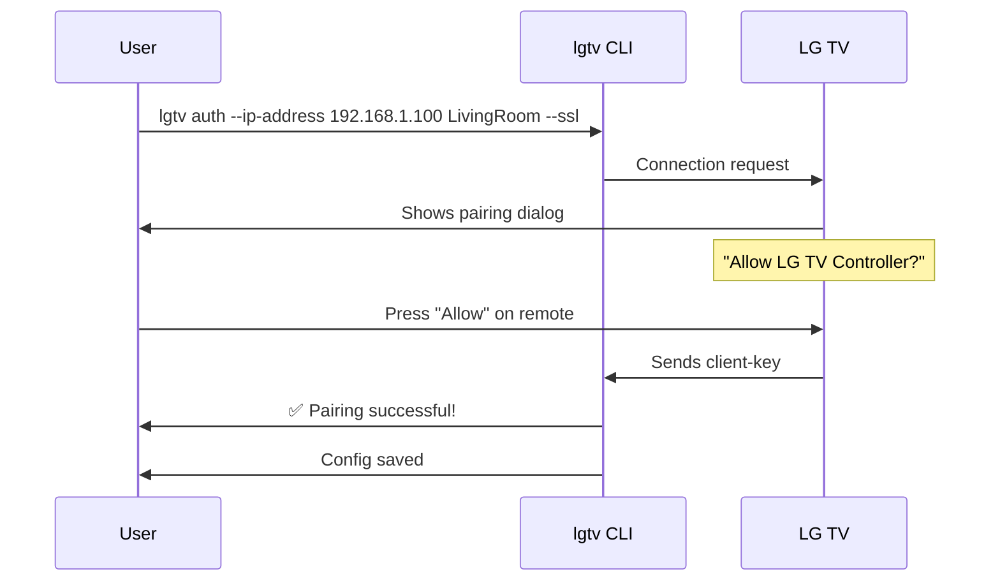

# Setup Guide

Complete guide to setting up and using the LG TV Controller.

## Overview

This guide walks you through the complete setup process, from initial installation to controlling your LG webOS TV from the command line.

## Prerequisites

Before you begin:

- ✅ LG webOS TV (powered on)
- ✅ Mac and TV on the same network
- ✅ TV remote available (for pairing approval)
- ✅ Swift 5.9+ installed

## Installation

### Build from Source

```bash
cd swift
swift build -c release
```

The binary will be located at `.build/release/lgtv`.

### Install to System

```bash
# Copy to a directory in your PATH
sudo cp .build/release/lgtv /usr/local/bin/

# Or use Homebrew's bin directory
cp .build/release/lgtv /opt/homebrew/bin/
```

## Quick Start

The fastest way to get started is using the interactive setup:

```bash
lgtv setup
```

This command provides step-by-step instructions for:
1. Checking prerequisites
2. Configuring network settings
3. Discovering your TV
4. Pairing with your TV
5. Testing the connection

## Detailed Setup

### Step 1: Network Configuration



**On Your TV:**
1. Press **Settings** on your remote
2. Navigate to **Network** → **Network Status** or **WiFi Connection**
3. Note your TV's IP address (e.g., `192.168.1.100`)

**Network Types:**

| Connection | Pros | Cons |
|-----------|------|------|
| **Ethernet** | Stable, can set static IP | Requires cable |
| **WiFi** | Wireless freedom | May disconnect, IP can change |

💡 **Tip**: For Ethernet, configure a static IP in your router's DHCP settings.

### Step 2: Discover Your TV

Scan your local network for LG TVs:

```bash
# Scan with SSL (recommended)
lgtv scan --ssl

# Scan without SSL
lgtv scan

# Scan another /24 subnet by seeding an IP
lgtv scan --ssl --ip-address 10.0.50.25

# Limit the scan to a specific range within a /24
lgtv scan --ip-address 10.0.50.10-40
```

`--ip-address` (alias `--ip`) accepts single IPv4 addresses, `/24` CIDR notation, or start-end ranges (e.g., `192.168.1.50-80`). Use it when your Mac sits on a different VLAN than the TV or when you already know the subnet you want to probe. The scan now fires off 1-second parallel probes (hitting common last-octet addresses first whenever it needs to sweep a /24) and then retries any responsive hosts with a longer handshake. Add `--debug` if you want to see both phases, including every probe attempt and error.

**Expected Output:**
```
🔍 Scanning for LG webOS TVs on local network...
📡 Local IP: 192.168.1.50
🌐 Scanning network: 192.168.1.0/24

━━━━━━━━━━━━━━━━━━━━━━━━━━━━━━━━━━━━━━━━━━━━━━━━
📺 FOUND 1 TV(S)
━━━━━━━━━━━━━━━━━━━━━━━━━━━━━━━━━━━━━━━━━━━━━━━━

IP Address: 192.168.1.100
Info: LG webOS TV (connection successful)

To pair with this TV:
  lgtv auth --ip-address 192.168.1.100 MyTV --ssl
```

### Step 3: Pair with Your TV



Run the auth command:

```bash
lgtv auth --ip-address <IP_ADDRESS> <TV_NAME> --ssl
```

**Example:**
```bash
lgtv auth --ip-address 192.168.1.100 LivingRoom --ssl
```

If you've already saved a configuration for `LivingRoom`, you can omit `--ip-address` and the CLI will reuse your saved personal IP automatically. Keep the flag when pairing a brand-new TV or when you need to override the stored address.

**What Happens:**

1. CLI connects to your TV
2. A pairing dialog appears on your TV screen
3. You press **Allow** on your TV remote
4. Authentication key is automatically saved to `~/.lgtv/lgtv/config/config.json`

**Pairing Output:**
```
🔗 Connecting to TV at 192.168.1.100...
📺 TV Name: LivingRoom
🔒 SSL: enabled

⏳ Establishing connection...

━━━━━━━━━━━━━━━━━━━━━━━━━━━━━━━━━━━━━━━━━━━━━━━━
📱 PAIRING REQUEST SENT TO YOUR TV
━━━━━━━━━━━━━━━━━━━━━━━━━━━━━━━━━━━━━━━━━━━━━━━━

👉 Please look at your TV screen now!
   A pairing request dialog should appear.

✅ Press 'Allow' or 'OK' on your TV remote to complete pairing.

⏱  Waiting for your response (this may take up to 30 seconds)...

━━━━━━━━━━━━━━━━━━━━━━━━━━━━━━━━━━━━━━━━━━━━━━━━
✨ PAIRING SUCCESSFUL!
━━━━━━━━━━━━━━━━━━━━━━━━━━━━━━━━━━━━━━━━━━━━━━━━

📁 Configuration saved to: ~/.lgtv/lgtv/config/config.json
🔧 MAC Address detected: aa:bb:cc:dd:ee:ff

🎉 You can now control your TV with commands like:
  lgtv sw-info --name LivingRoom --ssl
  lgtv volume-up --name LivingRoom --ssl
  lgtv off --name LivingRoom --ssl
```

### Step 4: Test Your Connection

Verify everything works:

```bash
# Get TV information
lgtv sw-info --name LivingRoom --ssl

# List installed apps
lgtv list-apps --name LivingRoom --ssl

# Test volume control
lgtv volume-up --name LivingRoom --ssl
lgtv volume-down --name LivingRoom --ssl
```

**Success Indicators:**
- ✅ Commands return JSON responses
- ✅ TV responds to volume changes
- ✅ No connection errors

## Configuration File

The pairing process creates a configuration file at:
```
~/.lgtv/lgtv/config/config.json
```

**Example Configuration:**
```json
[
  {
    "name": "LivingRoom",
    "ip": "192.168.1.100",
    "hostname": null,
    "mac": "aa:bb:cc:dd:ee:ff",
    "client-key": "abc123def456789"
  }
]
```

You can manually edit this file to:
- Add multiple TVs
- Update IP addresses
- Change TV names

## HDMI-CEC Setup

For Macs connected via HDMI, enable HDMI-CEC for automatic input switching:

**On Your TV:**
1. Settings → **General** → **HDMI Settings**
2. Enable **SIMPLINK (HDMI-CEC)**
3. Enable **Auto Power Sync** (optional)

**Benefits:**
- TV auto-switches to Mac input when Mac wakes
- TV can detect Mac power state
- Simplified automation

## macOS Integration

### Shell Aliases

Add to `~/.zshrc` or `~/.bashrc`:

```bash
# TV Control Aliases
tv() { lgtv "$@" --name LivingRoom --ssl; }
alias tv-on='lgtv screen-on --name LivingRoom --ssl'
alias tv-off='lgtv screen-off --name LivingRoom --ssl'
alias tv-vol-up='lgtv volume-up --name LivingRoom --ssl'
alias tv-vol-down='lgtv volume-down --name LivingRoom --ssl'
```

Usage:
```bash
tv sw-info
tv-on
tv-vol-up
```

### Keyboard Shortcuts

Use macOS Shortcuts app to create global hotkeys:

1. Open **Shortcuts** app
2. Create new shortcut
3. Add **Run Shell Script** action
4. Enter: `lgtv volume-up --name LivingRoom --ssl`
5. Assign keyboard shortcut

### Hammerspoon Automation

Automate TV control on Mac sleep/wake events. See the Hammerspoon integration in the repository root.

## Troubleshooting

### TV Not Found During Scan

**Solutions:**
1. Verify TV is powered on
2. Check both devices on same network
3. Disable VPN if active
4. Try scanning without `--ssl` flag
5. Manually use IP from TV settings

### Pairing Failed

**Solutions:**
1. Ensure pairing dialog appears on TV
2. Accept pairing within 30 seconds
3. Try without `--ssl` flag
4. Restart TV and try again
5. Check firewall settings

### Connection Timeout

**Solutions:**
1. Verify IP address is correct
2. Test with `ping <IP_ADDRESS>`
3. Check TV's network settings
4. Disable "Energy Saving" features on TV
5. Use Ethernet instead of WiFi

### Config Not Found Error

```
Error: Configuration not found for TV 'LivingRoom'
```

**Solution:** Run `lgtv auth` again to re-pair.

### IP Address Changed

If using DHCP, TV's IP may change. Solutions:

1. **Set Static IP** in router's DHCP settings
2. **Use Hostname** (if TV supports DNS)
3. **Re-run auth** with new IP address

## Advanced Configuration

### Multiple TVs

Pair with multiple TVs:

```bash
lgtv auth --ip-address 192.168.1.100 LivingRoom --ssl
lgtv auth --ip-address 192.168.1.101 Bedroom --ssl
```

Control different TVs:
```bash
lgtv off --name LivingRoom --ssl
lgtv off --name Bedroom --ssl
```

### SSL vs Non-SSL

| Mode | Port | Security | When to Use |
|------|------|----------|-------------|
| **SSL** (`--ssl`) | 3001 | Encrypted | Recommended (default) |
| **Non-SSL** | 3000 | Unencrypted | If SSL has issues |

The TV uses self-signed certificates, so the CLI accepts them automatically for LAN-only communication.

## Next Steps

- 📖 View all commands: `lgtv --help`
- 📝 Read command documentation: `lgtv <command> --help`
- 🔧 Create automation scripts
- 🎮 Set up Hammerspoon integration

## See Also

- <doc:UsingTheCLI>
- ``LGTVWebOSClient``
- <doc:ConfigurationManagement>
