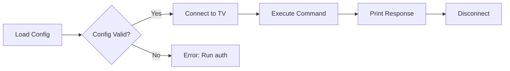
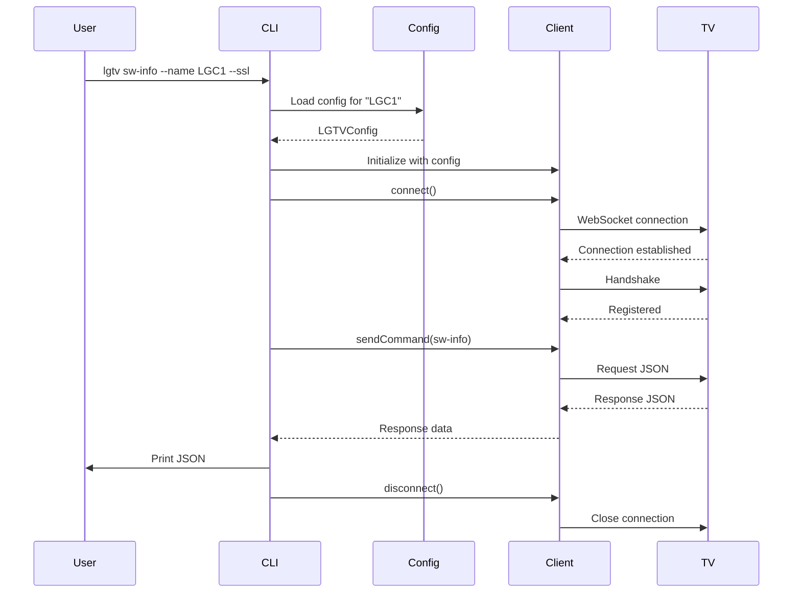

# Using the CLI

Learn how to use the lgtv command-line tool to control your LG webOS TV.

## Overview

The `lgtv` command-line tool provides a Swift-based interface for controlling LG webOS televisions. It replicates the functionality of the Python `lgtv` tool with native Swift performance.

## Installation

Build and install the tool using Swift Package Manager:

```bash
cd swift
swift build -c release
cp .build/release/lgtv /usr/local/bin/
```

## First Time Setup

Before using the CLI, you need to pair with your TV (authentication flow to be implemented).

## Discovering Your TV

Use the `scan` command to locate TVs on your network:

```bash
# Automatically use the Mac's active subnet
lgtv scan --ssl

# Seed a different /24 subnet
lgtv scan --ssl --ip-address 10.0.40.25

# Probe a narrow range inside a /24
lgtv scan --ip 10.0.40.10-40

# Show every probe attempt and error
lgtv scan --ssl --debug --ip-address 10.0.40.25
```

`--ip-address` (alias `--ip`) accepts single IPs, `/24` CIDR notation, or start-end ranges (e.g., `192.168.1.20-80`). The CLI derives the scan list from that seed when your Mac isn't on the same network as the TV, first blasting out 1-second parallel probes (prioritizing the common last octets when sweeping a /24) and then re-checking any responsive hosts with a longer handshake. Append `--debug` to print both phases plus any connection errors.

## Basic Usage Pattern



## Command Reference

### Information Commands

Get information about your TV:

```bash
# Software information
lgtv sw-info --name LGC1 --ssl

# Current app
lgtv get-foreground-app-info --name LGC1 --ssl

# List all installed apps
lgtv list-apps --name LGC1 --ssl

# List available inputs
lgtv list-inputs --name LGC1 --ssl
```

### Volume Control

Adjust audio settings:

```bash
# Increase volume
lgtv volume-up --name LGC1 --ssl

# Decrease volume
lgtv volume-down --name LGC1 --ssl

# Set specific volume level (0-100)
lgtv set-volume 25 --name LGC1 --ssl

# Mute/unmute
lgtv mute true --name LGC1 --ssl
lgtv mute false --name LGC1 --ssl
```

### Power Control

Manage TV power state:

```bash
# Turn TV off
lgtv off --name LGC1 --ssl

# Turn screen off (audio continues)
lgtv screen-off --name LGC1 --ssl

# Turn screen on
lgtv screen-on --name LGC1 --ssl

# Turn TV on (Wake-on-LAN, requires MAC address)
lgtv on --name LGC1
```

### Input and App Control

Switch inputs and launch apps:

```bash
# Switch to HDMI input
lgtv set-input HDMI_1 --name LGC1 --ssl

# Launch an app
lgtv start-app com.webos.app.hdmi1 --name LGC1 --ssl
lgtv start-app com.apple.appletv --name LGC1 --ssl
```

## Command Flow



## Output Format

All commands return JSON responses from the TV:

```json
{
    "type": "response",
    "id": "1",
    "payload": {
        "returnValue": true,
        "product_name": "webOSTV 6.0",
        "model_name": "HE_DTV_W21O_AFABATAA",
        "sw_type": "FIRMWARE",
        "major_ver": "03",
        "minor_ver": "40.87"
    }
}
```

## Configuration File

The CLI reads from `~/.lgtv/lgtv/config/config.json`:

```json
[
  {
    "name": "LGC1",
    "ip": "192.168.1.100",
    "hostname": "lg-tv.local",
    "mac": "AA:BB:CC:DD:EE:FF",
    "client-key": "abc123def456"
  }
]
```

## Error Handling

Common errors and solutions:

### Configuration Not Found

```
Error: Configuration not found for TV 'LGC1'. Please run auth first.
```

**Solution**: Run the auth command to pair with your TV (to be implemented).

### Connection Failed

```
Error: Unable to connect to TV
```

**Solutions**:
- Verify the TV is powered on
- Check IP address in config
- Ensure TV and computer are on same network
- Try with/without --ssl flag

### MAC Address Required

```
Error: MAC address is required for Wake-on-LAN
```

**Solution**: Add the TV's MAC address to the configuration file.

## Differences from Python Tool

The Swift port maintains command compatibility but has some differences:

| Feature | Python | Swift |
|---------|--------|-------|
| Command names | snake_case | kebab-case |
| SSL flag position | Varies | Always `--ssl` |
| Auth flow | Implemented | To be implemented |
| Wake-on-LAN | Implemented | To be implemented |

## Tips and Best Practices

### Using Aliases

Create shell aliases for common commands:

```bash
alias tv-on="lgtv on --name LGC1"
alias tv-off="lgtv off --name LGC1 --ssl"
alias tv-vol-up="lgtv volume-up --name LGC1 --ssl"
alias tv-vol-down="lgtv volume-down --name LGC1 --ssl"
```

### Piping Output

Process JSON responses with `jq`:

```bash
# Extract just the model name
lgtv sw-info --name LGC1 --ssl | jq '.payload.model_name'

# Get list of app IDs
lgtv list-apps --name LGC1 --ssl | jq '.payload.apps[].id'

# Find HDMI inputs
lgtv list-inputs --name LGC1 --ssl | jq '.payload.devices[] | select(.id | startswith("HDMI"))'
```

### Scripting

Use in shell scripts for automation:

```bash
#!/bin/bash
# Turn on TV and switch to Apple TV

lgtv on --name LGC1
sleep 5  # Wait for TV to boot
lgtv start-app com.apple.appletv --name LGC1 --ssl
```

## See Also

- ``LGTVControllerCLI``
- [LGTVWebOSController](../LGTVWebOSController/documentation/lgtvweboscontroller)
