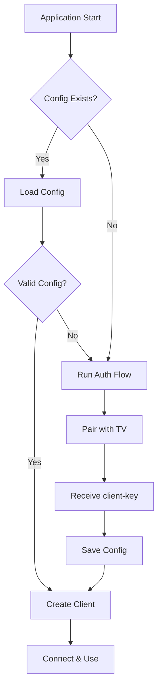
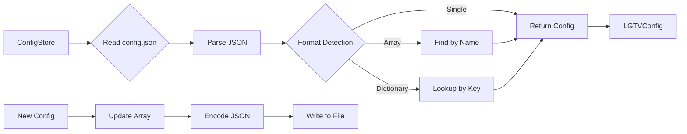

# Configuration Management

Learn how to store and retrieve LG TV configurations using the ConfigStore.

## Overview

The LGTVWebOSController library provides a configuration management system that stores TV connection details and authentication keys. This allows seamless reconnection to previously paired TVs.

## Configuration Structure

The ``LGTVConfig`` struct stores all information needed to connect to a TV:

```swift
public struct LGTVConfig: Codable {
    public var name: String           // Friendly name (e.g., "LGC1")
    public var ip: String             // TV IP address
    public var hostname: String?      // Optional hostname
    public var mac: String?           // Optional MAC for Wake-on-LAN
    public var clientKey: String?     // Authentication key from pairing
}
```

### JSON Encoding

The `clientKey` property uses a custom `CodingKey` to match the Python tool's format:

```swift
enum CodingKeys: String, CodingKey {
    case name
    case ip
    case hostname
    case mac
    case clientKey = "client-key"  // Hyphenated in JSON
}
```

## Storage Location

Configurations are stored in the user's home directory for compatibility with the Python `lgtv` tool:

```
~/.lgtv/lgtv/config/config.json
```

This path structure matches the Python LGWebOSRemote implementation, allowing both tools to share configuration data.

## Configuration Flow



## Using ConfigStore

The ``ConfigStore`` class handles all file operations:

### Loading a Configuration

```swift
let store = ConfigStore()
if let config = store.loadConfig(name: "LGC1") {
    let client = LGTVWebOSClient(
        name: config.name,
        ip: config.ip,
        mac: config.mac,
        hostname: config.hostname,
        clientKey: config.clientKey,
        useSSL: true
    )
}
```

### Saving a Configuration

```swift
let config = LGTVConfig(
    name: "LGC1",
    ip: "192.168.1.100",
    hostname: "lg-tv.local",
    mac: "AA:BB:CC:DD:EE:FF",
    clientKey: "abc123def456"
)

try store.saveConfig(config)
```

### Loading All Configurations

```swift
let configs = store.loadAllConfigs()
for config in configs {
    print("\(config.name): \(config.ip)")
}
```

### Deleting a Configuration

```swift
try store.deleteConfig(name: "LGC1")
```

## File Format Compatibility

The ConfigStore supports multiple JSON formats for maximum compatibility:

### Single Configuration

```json
{
  "name": "LGC1",
  "ip": "192.168.1.100",
  "hostname": "lg-tv.local",
  "mac": "AA:BB:CC:DD:EE:FF",
  "client-key": "abc123def456"
}
```

### Array of Configurations

```json
[
  {
    "name": "LGC1",
    "ip": "192.168.1.100",
    "client-key": "abc123"
  },
  {
    "name": "BedroomTV",
    "ip": "192.168.1.101",
    "client-key": "def456"
  }
]
```

### Dictionary of Configurations

```json
{
  "LGC1": {
    "name": "LGC1",
    "ip": "192.168.1.100",
    "client-key": "abc123"
  },
  "BedroomTV": {
    "name": "BedroomTV",
    "ip": "192.168.1.101",
    "client-key": "def456"
  }
}
```

## Data Flow



## Best Practices

### Directory Creation

The ConfigStore automatically creates the config directory:

```swift
try FileManager.default.createDirectory(
    at: configDirectory,
    withIntermediateDirectories: true,
    attributes: nil
)
```

### Atomic Updates

When saving, existing configurations are loaded, updated, and written back:

1. Load all existing configs
2. Update or append the new config
3. Write the complete array back to file

This prevents data loss from concurrent access.

### Error Handling

Configuration errors are handled gracefully:

```swift
guard let config = try? store.loadConfig(name: "LGC1") else {
    print("Configuration not found. Run auth first.")
    return
}
```

## Migration from Python

The Swift implementation is fully compatible with Python LGWebOSRemote configurations:

| Python Path | Swift Path |
|------------|------------|
| `~/.lgtv/lgtv/config/config.json` | Same |
| Field: `client-key` | Same (via CodingKeys) |
| Field: `name`, `ip`, `mac` | Same |

Both tools can read and write the same configuration files without modification.

## See Also

- ``LGTVConfig``
- ``ConfigStore``
- <doc:WebSocketConnection>
