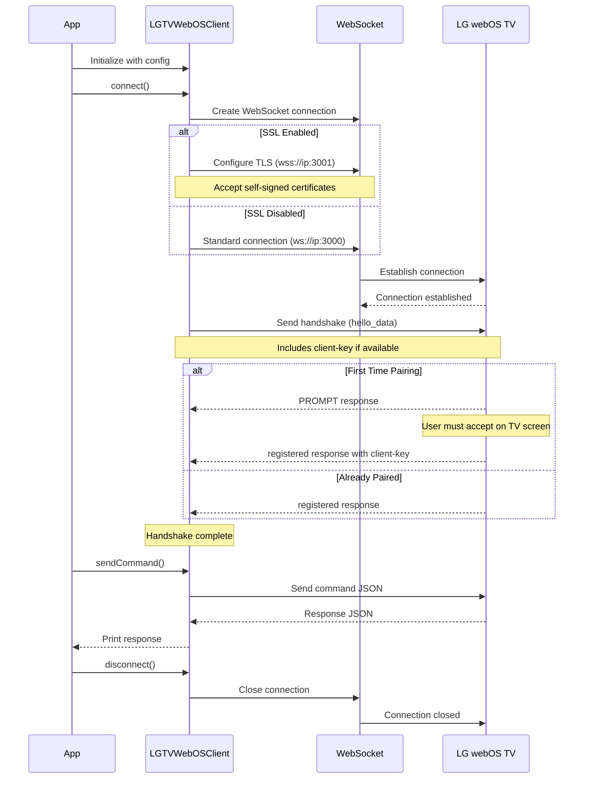
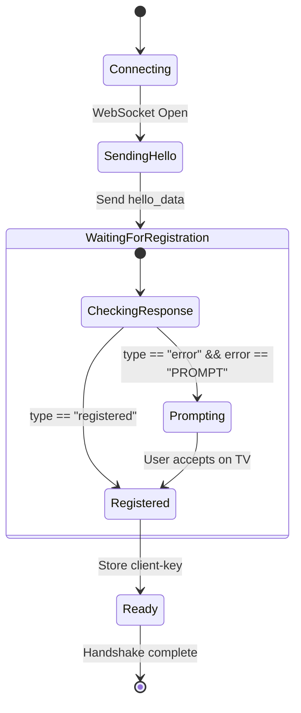

# WebSocket Connection Architecture

Learn how the LGTVWebOSController establishes and maintains WebSocket connections to LG webOS TVs.

## Overview

The LGTVWebOSController library uses WebSocket connections to communicate with LG webOS televisions. The connection process involves TLS configuration, authentication handshake, and bi-directional message passing.

## Connection Flow

The following diagram illustrates the complete connection flow from initialization to command execution:



## WebSocket Protocol

### Connection Endpoints

The TV exposes two WebSocket endpoints:

- **Non-SSL**: `ws://[tv-ip]:3000/`
- **SSL**: `wss://[tv-ip]:3001/`

###  URL Format

```swift
let scheme = useSSL ? "wss" : "ws"
let port = useSSL ? 3001 : 3000
let url = "\(scheme)://\(ip):\(port)/"
```

## TLS Configuration

When using SSL connections, the library configures TLS to accept self-signed certificates from the TV:

```swift
var tlsConfiguration = TLSConfiguration.makeClientConfiguration()
tlsConfiguration.certificateVerification = .none
```

> Important: The `.none` certificate verification is acceptable for LAN-only TV communication but should never be used for internet-facing services.

### Security Considerations

- The TV uses a self-signed certificate
- Communication occurs over local network only
- No sensitive data beyond TV control commands is transmitted
- The client-key provides basic access control

## Message Format

All WebSocket messages use JSON encoding with the following structure:

### Outgoing Command

```json
{
  "type": "request",
  "id": "command_123",
  "uri": "ssap://audio/volumeUp",
  "payload": {
    // Optional command-specific data
  }
}
```

### Incoming Response

```json
{
  "type": "response",
  "id": "command_123",
  "payload": {
    "returnValue": true,
    // Command-specific response data
  }
}
```

## Handshake Process

The handshake establishes a trusted connection between the client and TV:



### Hello Data Structure

The handshake message includes:

```swift
let helloPayload: [String: Any] = [
    "forcePairing": false,
    "pairingType": "PROMPT",
    "manifest": [
        "manifestVersion": 1,
        "appVersion": "1.0.0",
        "signed": [
            "created": "20240101",
            "appId": "com.lge.test",
            "vendorId": "com.lge",
            "localizedAppNames": [...],
            "permissions": [...]
        ]
    ],
    "client-key": clientKey // If available from previous pairing
]
```

## JSON Encoding and Decoding

The library uses Swift's `Codable` protocol with custom types for dynamic JSON:

### AnyCodable Type

The ``AnyCodable`` struct handles dynamic JSON values:

```swift
public struct AnyCodable: Codable {
    public let value: Any
    
    // Handles: Bool, Int, Double, String, Array, Dictionary, NSNull
}
```

This allows responses with varying payload structures to be decoded uniformly.

## Error Handling

The ``LGTVError`` enum defines connection errors:

- `invalidURL`: Malformed WebSocket URL
- `notConnected`: Operation attempted without active connection
- `handshakeFailed`: TV did not complete registration
- `encodingFailed`: Unable to encode command as JSON

## Implementation Details

### Event Loop

The library uses SwiftNIO's `MultiThreadedEventLoopGroup`:

```swift
private let eventLoopGroup: MultiThreadedEventLoopGroup

init(...) {
    self.eventLoopGroup = MultiThreadedEventLoopGroup(numberOfThreads: 1)
}
```

### Message Handler

Incoming messages are processed asynchronously:

```swift
ws?.onText { [weak self] ws, text in
    self?.handleMessage(text)
}
```

### Command Counter

Each command receives a unique ID:

```swift
commandCount += 1
let commandId = "\(commandCount)"
```

## Related Resources

- [LG webOS API Documentation](https://webostv.developer.lge.com/)
- [WebSocket Protocol RFC 6455](https://tools.ietf.org/html/rfc6455)
- [SwiftNIO WebSocket](https://github.com/apple/swift-nio)
- [Swift-NIO-SSL](https://github.com/apple/swift-nio-ssl)

## See Also

- ``LGTVWebOSClient``
- <doc:ConfigurationManagement>
